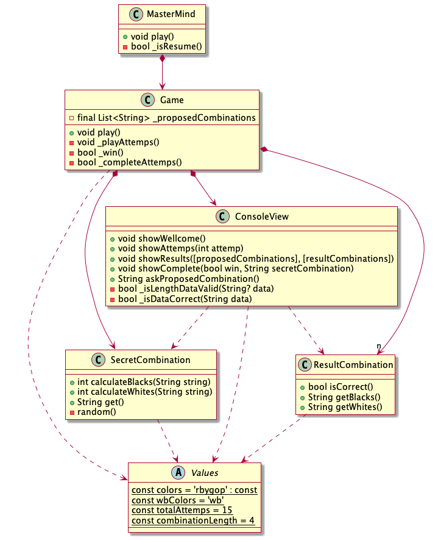

#  MasterMind

## juego de mesa

Mastermind es un juego de mesa, de ingenio y reflexión, para dos jugadores.

## reglas

Se juega en un tablero con fichas blancas y negras pequeñas y de otros colores, de un tamaño algo superior.

La zona de juego del tablero consta de filas con 5 orificios grandes (para las fichas de colores) y 5 pequeñas (para las fichas blancas y negras).

Uno de los jugadores escoge una combinación secreta de 5 fichas de colores, y la oculta al otro jugador (Solo se permiten 1 ficha del mismo color en la combinación secreta).

El segundo jugador, toma fichas de colores del mismo conjunto, y coloca 5 con colores y posiciones al azar en los orificios grandes de la primera fila.

El primer jugador coloca en los orificios pequeñas de la misma fila y en la misma posición fichas negras (si el color de la combinación creada coincide con la conbinación secreta) o blancas (si el color de la combinación creada aparece en la combinación secreta pero en otra posición).

Con la información anterior, el segundo jugador vuelve a apostar con una nueva combinación en la siguiente fila.

La partida termina al averiguarse la combinación, o bien se agota el tablero (10 combinaciones).

## Modelo del dominio

### Vocabulario


### Casos de uso


### instrucciones


## Versiones EscuelaIT

### Interfaz de Usuario

Interfaz de usuario de salida por consola:

```
----- MASTERMIND -----

0 attemps:
xxxx
propose a combination: pgroy
wrong propose combination length
propose a combination: pgrñ
wrong colors, they must be: rbygop
propose a combination: pgro

1 attemps:
xxxx
pgro ---> 0 blacks, 3 White
propose a combination: rpgb

2 attemps:
xxxx
pgro ---> 0 blacks, 3 White
rpgb ---> 2 blacks, 2 White
propose a combination: rpgo

3 attemps:
xxxx
pgro ---> 0 blacks, 3 White
rpgb ---> 2 blacks, 2 White
rpgo ---> 2 blacks, 2 White
propose a combination: rpog

4 attemps:
xxxx
pgro ---> 0 blacks, 3 White
rpgb ---> 2 blacks, 2 White
rpgo ---> 2 blacks, 2 White
rpog ---> 4 blacks, 0 White
you've won!!! ;-)
RESUME? (y/n): y

```

### Modelo del diseño

### v2_oop



### v3_separate_views


### v4_several_tecnologies_views


### v5_controllers


